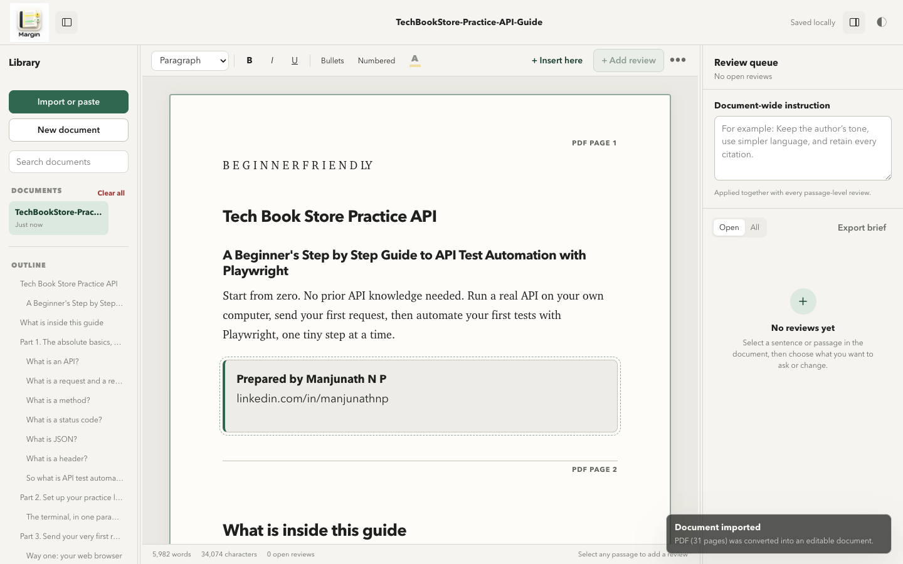

  

<h1 align="center">Margin</h1>

  Review long documents, capture precise feedback, and export one clear revision brief.

  <a href="https://github.com/manjunathnp/Margin/releases/tag/v1.0.0">Download v1.0.0</a>

The screenshot above shows a fresh Margin workspace after importing the 31-page **Tech Book Store Practice API Guide** PDF.

## What Margin does

Margin is a document review workspace that runs in your browser. It helps you work through long material without losing the exact place or context behind each comment.

- Import a document or paste content directly.
- Select a sentence, passage, table, code block, or information block.
- Add a question, note, rewrite request, simplification request, or verification request.
- Insert a review at an exact position between sections.
- Add one document-wide instruction when the same guidance applies throughout.
- Export the complete review brief when the document is ready for revision.

## Get started

1. Download [`Margin-v1.0.0.html`](https://github.com/manjunathnp/Margin/releases/download/v1.0.0/Margin-v1.0.0.html).
2. Open the file in a current browser. Chrome or Edge is recommended for the broadest PDF support.
3. Choose **Import or paste**.
4. Select a file or paste your content.
5. Start reviewing.

There is no installer and no separate launcher.

## Main features

### Document workspace

- Editable document view for short notes, long reports, and book-length content
- Resizable and collapsible Library and Review panels
- Searchable document library and automatic heading outline
- Light and dark themes with a readable document surface
- Individual document deletion and guarded **Clear all**

### Review tools

- Ask, Simplify, Rewrite, Verify, and Note actions
- Exact-position insertion reviews
- Reviews for text and structured blocks
- Yellow, green, blue, and pink highlights
- Direct highlight removal
- Review queue with open and complete states
- Document-wide instructions

### Code and structured content

- Inline code without placeholder artifacts
- Language-aware, colored code blocks
- Code language selection for JavaScript, TypeScript, Python, HTML, CSS, JSON, SQL, Bash, PowerShell, Java, C, C++, C#, Go, Rust, PHP, Ruby, Swift, Kotlin, R, Markdown, YAML, Dockerfile, and XML
- Review controls for tables, code blocks, images, and information blocks

## Supported formats

| Direction | Formats |
| --- | --- |
| Import | PDF, DOCX, Markdown, TXT, HTML, RTF, CSV, JSON, XML, and rich pasted content |
| Document export | Word-compatible DOC, PDF through the browser print dialog, HTML, Markdown, and plain text |
| Review export | Structured Markdown brief containing the source document, document-wide instruction, and review items |

PDF import reconstructs selectable text, headings, tables, inline code, and code blocks where the source PDF provides enough structure. Image-only or scanned PDFs require OCR before import.

## How it works

Margin is distributed as one self-contained HTML application. Its interface, styles, application code, logo, PDF reader, and PDF worker are embedded in that file.

- Documents and review state are stored in the browser with IndexedDB.
- PDF processing uses an embedded PDF.js runtime.
- Imported content is converted into editable HTML and sanitized before it enters the workspace.
- The app does not need a build step, local server, or background process to run.

Browser storage belongs to the browser and profile that opened Margin. Export important documents or review briefs when you need a portable copy or backup.

## Repository contents

| Path | Purpose |
| --- | --- |
| `Margin-v1.0.0.html` | Complete application |
| `README.md` | Product and usage guide |
| `assets/brand/margin-logo.png` | Margin logo used in this README |
| `assets/screenshots/margin-tech-book-store.png` | Fresh-install product screenshot |

## Release

The current release is [Margin v1.0.0](https://github.com/manjunathnp/Margin/releases/tag/v1.0.0).
